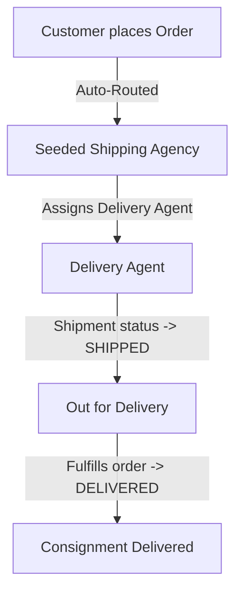
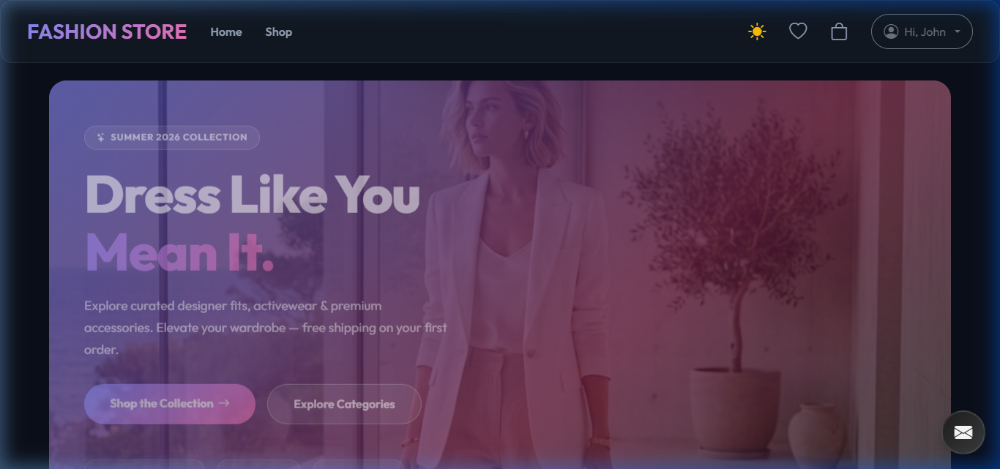
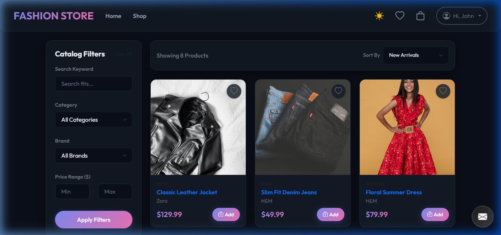
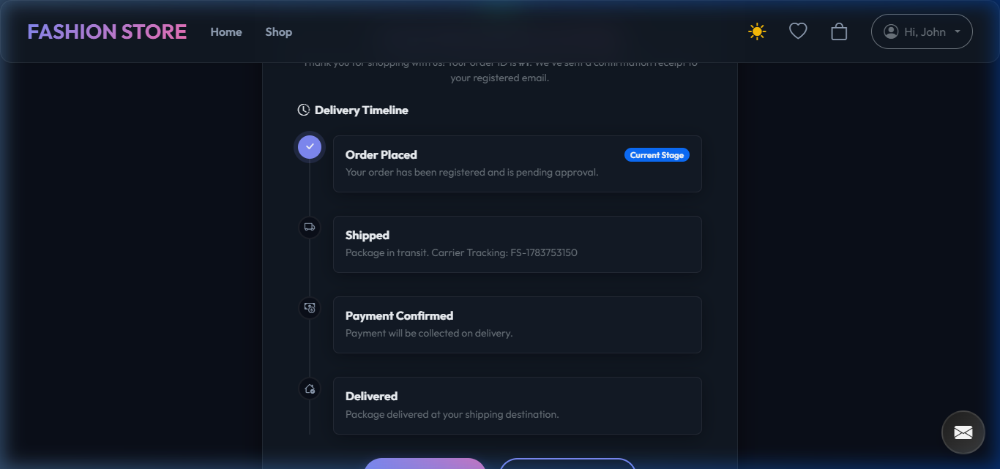
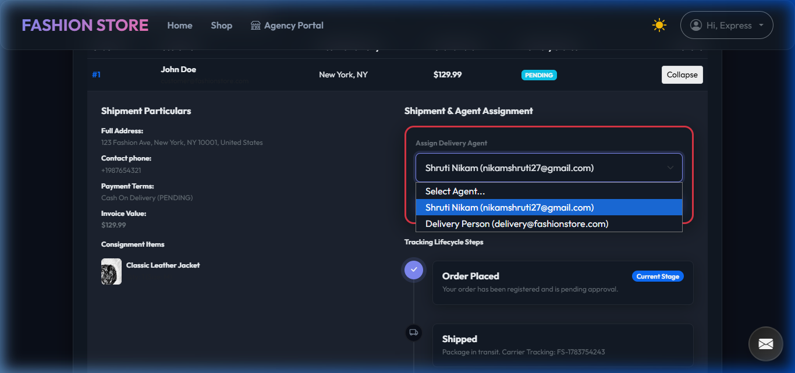
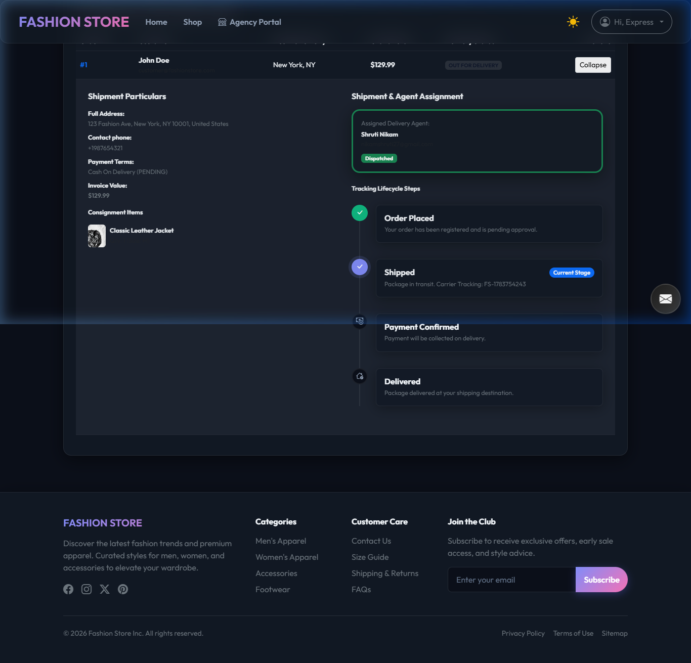
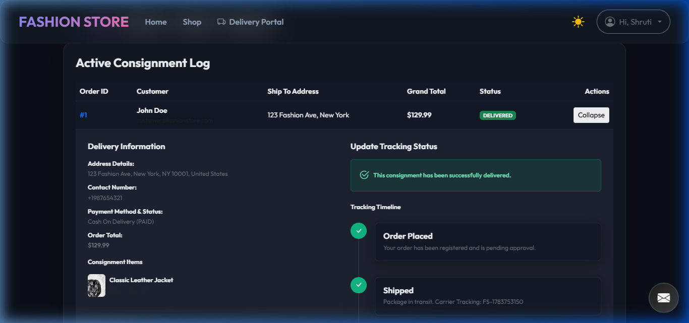

# Fashion E-Commerce Website with Agency-Based Delivery Flow

A premium, full-stack fashion e-commerce application demonstrating a React SPA frontend, a secure Spring Boot REST API backend with Role-Based Access Control (RBAC), mock online card payments, database persistent cart checkouts, dynamic PDF invoice dispatch, and an **Agency-driven Delivery Management Workflow**.

---

## 🛠️ Architecture & Delivery Workflow

This application features a robust consignment routing lifecycle that divides roles between Customers, shipping Agencies, and Delivery Agents:



1. **Order Routing**: When a customer places an order, the system automatically routes it to an active shipping **Agency** (seeded to `agency1@fashionstore.com`).
2. **Dispatch & Assignment**: The Agency logs in, views their ledger of assigned orders, selects one of their delivery agents (e.g., `delivery1@fashionstore.com`), and ships the consignment. This transitions the order status to `SHIPPED` (shipment added).
3. **Notifications**: Real-time emails are dispatched automatically using Spring's JavaMailSender:
   - **Delivery Agent** receives package specifications, delivery instructions, and the customer's shipping address.
   - **Customer** receives agent details, agent contact information, and shipping tracking numbers.
4. **Fulfillment**: The Delivery Agent logs into the portal, sees their list of active shipments, and marks the task as `DELIVERED` upon completion.

---

## 📸 Screenshots

### 1. Storefront Landing Page


### 2. Product Catalog / Shop Page


### 3. Customer Checkout Success


### 4. Agency Agent Assignment Selector


### 5. Shipped Consignment Status


### 6. Delivery Agent Fulfillment


---

## 📂 Project Structure

```text
fashion-store/
├── frontend/                  # React SPA Client (Vite)
│   ├── src/
│   │   ├── assets/            # Global images & icons
│   │   ├── components/        # Reusable layout elements (Navbar, Timeline, Sidebar)
│   │   ├── context/           # Global States Providers (AuthContext, CartContext)
│   │   ├── pages/             # App pages (Home, Shop, Details, Checkout, Dashboard)
│   │   │   ├── agency/        # Agency Portal pages (AgencyDashboard)
│   │   │   └── delivery/      # Delivery Agent Portal pages (DeliveryDashboard)
│   │   └── index.css          # Styled theme configuration & overrides
│   ├── index.html
│   └── package.json
│
├── backend/                   # Spring Boot REST API Server
│   ├── src/main/java/com/fashionstore/
│   │   ├── config/            # JWT Filters, Security settings, Resource Mappers
│   │   ├── controller/        # REST Endpoints (Auth, Cart, Orders, Admin, Agency, Delivery)
│   │   ├── dto/               # Records mapping API Requests & Responses
│   │   ├── model/             # JPA Database Entities (User, Product, Order, Role)
│   │   ├── repository/        # Spring Data CRUD Repositories (UserRepository, OrderRepository)
│   │   └── service/           # Logic Services (Auth, checkout, invoices, email)
│   ├── src/main/resources/
│   │   ├── schema.sql         # H2 Schema DDL (Auto-run on startup)
│   │   ├── data.sql           # H2 Seed Data DML (Auto-run on startup)
│   │   └── application.properties
│   └── pom.xml
│
└── database/                  # Local Database SQL Schemas (MySQL)
    ├── schema.sql             # SQL Script for table structures
    └── data.sql               # Seed script with default products and accounts
```

---

## 👤 Seeded Accounts (Test Credentials)
*All seeded accounts share the password:* **`password123`**

*   **Store Administrator**: `admin@fashionstore.com`
*   **Customer User**: `customer@fashionstore.com`
*   **Secondary Customer**: `jane.smith@fashionstore.com`
*   **Shipping Agency**: `agency1@fashionstore.com`
*   **Delivery Agent**: `delivery1@fashionstore.com`
*   **Secondary Delivery**: `delivery@fashionstore.com`

---

## 🚀 Setup & Execution Guide

### 1. Prerequisites
Ensure you have the following installed on your developer machine:
- **Java JDK 21** or later (Verify with `java -version`)
- **Node.js LTS** (Verify with `node -v`)

---

### 2. Running the Backend (Spring Boot)

1. Navigate to the backend folder:
   ```bash
   cd backend
   ```
2. Compile and launch the application using the Maven Wrapper:
   ```bash
   # Windows PowerShell
   ./mvnw spring-boot:run
   
   # macOS / Linux
   chmod +x mvnw
   ./mvnw spring-boot:run
   ```
3. The API Server will start on [http://localhost:8080](http://localhost:8080).
4. **H2 Web Console**: Access the database explorer at [http://localhost:8080/h2-console](http://localhost:8080/h2-console) (JDBC URL: `jdbc:h2:mem:fashiondb`, User: `sa`, Password: *empty*).

---

### 3. Running the Frontend (React Vite)

1. Navigate to the frontend folder:
   ```bash
   cd frontend
   ```
2. Install dependencies:
   ```bash
   npm install
   ```
3. Start the local development server:
   ```bash
   npm run dev
   ```
4. Open your browser and navigate to [http://localhost:5173](http://localhost:5173) to explore the app!
